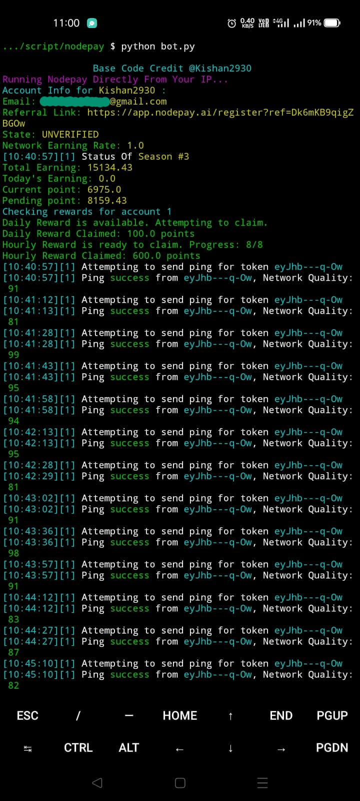

# SIMPLE SCRIPT TO RUN NODEPAY ON YOUR ANDROID PHONE USING TERMUX, NOT NEEDING ANY BROWSER AND EXTENSION

## Nodepay.ai


Nodepay.ai Bot auto ping

Register to Nodepay.ai : [https://app.nodepay.ai/register](https://app.nodepay.ai/register?ref=Dk6mKB9qigZBGOw)

Special Thanks to [ashtrobe](https://github.com/ashtrobe)

## Feature Update

- Daily reward Point will be collect
- Hourly Reward will be claim (Mobile feature is now in my script)
- Constant Pinning from your device IP
- Multiple Accounts support

**Install Termux and Configure the Script-**

```
pkg install git
```

```
pkg install nano
```

```
pkg install python
```

```
git clone https://github.com/kishan2930/nodepay.git
```

```
cd nodepaywoex-py
```

```
pip install -r requirements.txt
```

# **Before running the bot, you need to put your token inside user.txt file**

**To get your Bearer token:**

- Download and install kiwi browser in your phone.
- Go to Nodepay dashboard.
- Open Developer Tools in kiwi browser.

- Go to the **Console** tab in Developer Tools.

- Type the following command to get your token:

  ```bash
  localStorage.getItem('np_webapp_token')
  ```

- This will return the Bearer token. ex: eyJhbGciOi.......

**Paste the token in `tokens.txt`**:

```
nano tokens.txt
```

**Run the Script-**

```
python bot.py
```
